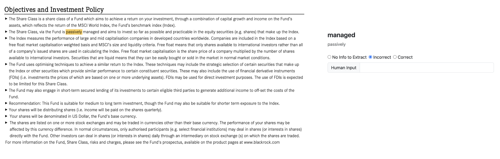

# QA-4-Domain-Agnostic-IE-Dataset

**TL;DR** -> This repository contains the PDFs and the produced datasets used for the paper “Leveraging Question Answering for Domain-Agnostic Information Extraction".

Read this **README** for a more in-depth understanding of the dataset files.

## Introduction

In the paper “Leveraging Question Answering for Domain-Agnostic Information Extraction" we present an approach for extracting information from technical documents on different domains, with minimal effort. It leverages on generic models for Question Answering and on questions formulated with target properties in mind. These are made to specific sections where the answer, then used as the value for the property, should reside. We further describe how this approach was applied to documents of two very different domains: toxicology and finance.

In both cases, an evaluation was performed by domain experts using a web application where the user could upload the supported PDFs. After the IE process finished,  the information extracted was provided though a visual crop of the PDF used and an evaluation mechanism in order to obtain the evaluator's feedback. The image below demonstrates the elements that were presented to the evaluators: the crop section of the document, *i.e.*, the text relevant to the key property, the information extracted for that property, and a mechanism to evaluate the information extracted.

 
## Datasets per Use Case

Although the approach used for both domains is the same, slight differences were made in the evaluation, mainly in the creation of the datasets. So for each use case the dataset will be explained in the following sections.

All the PDFs used in both use cases are public. In the toxicology use case, the Scientific Committee on Consumer Safety (SCCS) opinions can be found in [here](https://health.ec.europa.eu/scientific-committees/scientific-committee-consumer-safety-sccs/sccs-opinions_en) and Australian Insustrial Chemicals Introduction Scheme (AICIS) reports can be found [here](https://services.industrialchemicals.gov.au/search-assessments/).

As in the financial use case, the providers used were iShares ([link](https://www.ishares.com/us)), XTrackers ([link](https://etf.dws.com/en-gb/)), Amundi ([link](https://about.amundi.com/)) and Vanguard ([link](https://investor.vanguard.com/investment-products/list/etfs)). 

All the files used are publicly accessible through the mentioned websites, but we provide all the files used in the folder **PDFs** in order to facilitate the repeatability of the evaluation.

### Toxicological Use Case

In this use case, an initial evaluation was performed by an expert and the sheet **“Expert Evaluations”** in the file **“Dataset - Toxicology Use Case”** as created. We defined that sheet as the “reference dataset” where we had enough feedback from the expert to build a standard dataset.

Then we proceeded to repeat the process of extracting information from the toxicological reports, but this time we compared the extractions with the reference file. We repeated this step for multiple models but, as mentioned in the article,  we followed our studies using the RoBERTa model fine-tuned for Question Answering, which originated the results present in the sheet **“RoBERTa Model Extractions”**. 

To compare the extractions from RoBERTa to the reference datast, we used similarity metrics, in this case ROUGE, to score how similar the extractions were. 

#### Evaluation using the dataset

The reference dataset created has the following header:
1. **File**: the file name of the PDF.
1. **Section**: the section of the PDF relevant to the toxicological property that we want to extract information about.
1. **Subsection**: a more specific part of the document inside the section mentioned. When subsection is 0, then there is no subsection in the section.
1. **Property**: the variable that we intend to extract information about
1. **Info Extracted**: the information extracted from our process.
1. **Input Type**: the type of input made by the evaluator. It can be “Likert” or “Input”. When is “Likert”, then in **Input User** there is a value selected from the likert scale. If the value is “Input” then in **Input User** the evaluator could introduce any text (which could be improvements, completions or corrections of the extractions).
1. **Input User**: the input made by the user, which can be one value from the likert scale or text as mentioned previously. The values from the likert scale go from 0 to 3, where 0 means “No information in the document”, 1 means “Information extracted incorrect”, 2 means “information extracted incomplete”,  and 3 means “information extracted correct”.

Similarly, the dataset of the extractions using the RoBERTa model follows a very similar structure. The only differences are:
- there are no columns **Input Type** and **Input User** since there are no different input types and no feedback from any human.
- the column **Comparison to reference** stores the results of the comparisons made between the information extracted and the reference dataset. From 0 to 3 the values have the same meaning as in the reference dataset created. The only difference is the addition of 5, which represents that no extractions that we were unable to directly relate to the reference dataset. **From our analysis, this could happen due to a more restrict analyze from the human expert**, *i.e.*, a narrower set of sections and respective properties extracted, where in the extraction using RoBERTa a broader range of values could be extracted, meaning that no direct correspondence could be made. We ignored these cases in the evaluation.

##### Results Obtained 

|  | AICIS| SCCS | **All** |
| :---------------: | :---------------: | :---------------: | :---------------: |
| Precision| 0.70| 0.76 | **0.74** |  
| Recall| 0.61 | 0.82 | **0.72**| 
| Accuracy | 0.72 | 0.68 | **0.75** | 
| F-Score| 0.66 | 0.79 | **0.73** | 

### Finance Use Case

Regarding the evaluation of the financial use case, the process was similar, but in this case, we evaluated directly from the expert's feedback. So, instead of creating a reference, we performed the extraction of information, and using the feedback of the expert, we evaluated directly. The file **Dataset - Finance Use Case** is the dataset created from the feedback of the expert. 

#### Evaluation using the dataset

The dataset has the following header:

1. **KIID Type**: the provider that produced the PDF.
1. **Document**: file name of the PDF.
1. **Section**: the name of the section of the paper that was identified as the section related to the variable that we intend to extract information about.
1. **Variable**: the information that we desire to obtain information about.
1. **Info Extracted**: the information extracted from our process.
1. **Input Type**: similar to the reference dataset in the toxicological use case, there are two types of inputs, “Likert” and “Input”, which have exactly the same meaning as previously.
1. **Input User**: exactly as in the precious use case, in this column is present the input from the user. If the value in **Input Type** is “Input”, then the evaluator could introduce any text. If it is “Likert”, then it is a value from a likert scale. The scale in this case is simpler, it is just 0 or 2. 0 means that there is no information to extract, 1 corresponds to when the information extracted is incorrect, and 2 corresponds to when the information extracted is correct.

We opted to use a simpler likert scale in this use case due to the type of data that we were extracting from the documents and the documents itself. Has the documents are regulated, we could establish some rules to facilitate our process.

<!--
*Note*: the data that was not available in the documents was explicited mentioned has not available, and in those cases the information was that.
-->

##### Results Obtained 

|  | iShares | XTrackers| Amundi | Vanguard | **All** |
| :---------------: | :---------------: | :---------------: | :---------------: | :---------------: | :---------------: | 
| Precision| 0.98| 0.98 | 0.95 | 0.80| **0.95** |  
| Recall| 0.95 | 0.83 | 0.62 | 0.80 | **0.86**| 
| Accuracy | 0.93 | 0.81 | 0.60| 0.67 | **0.82** | 
| F-Score| 0.96 | 0.90 | 0.75 | 0.80 | **0.90** | 

